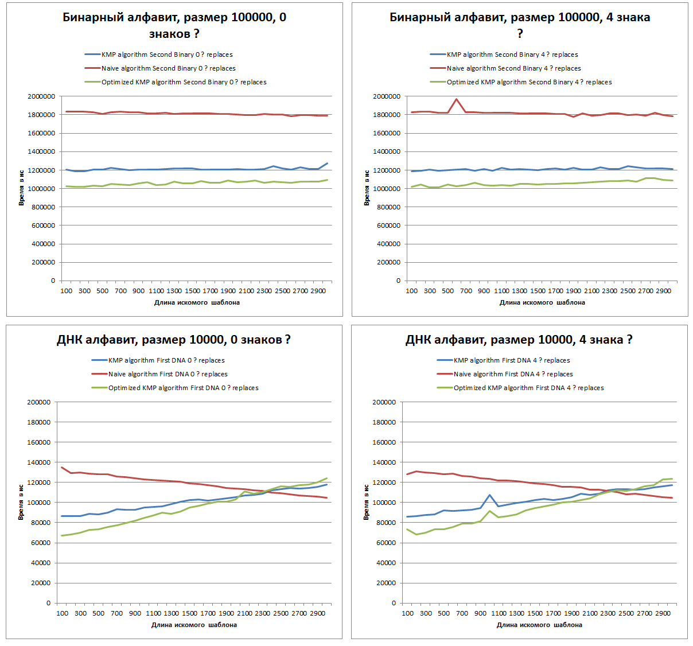
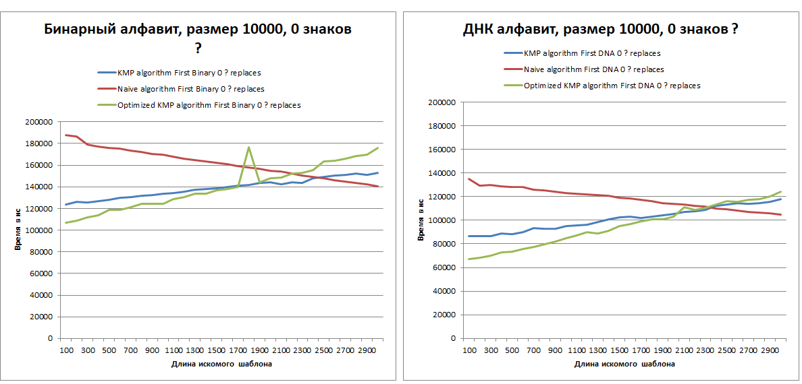
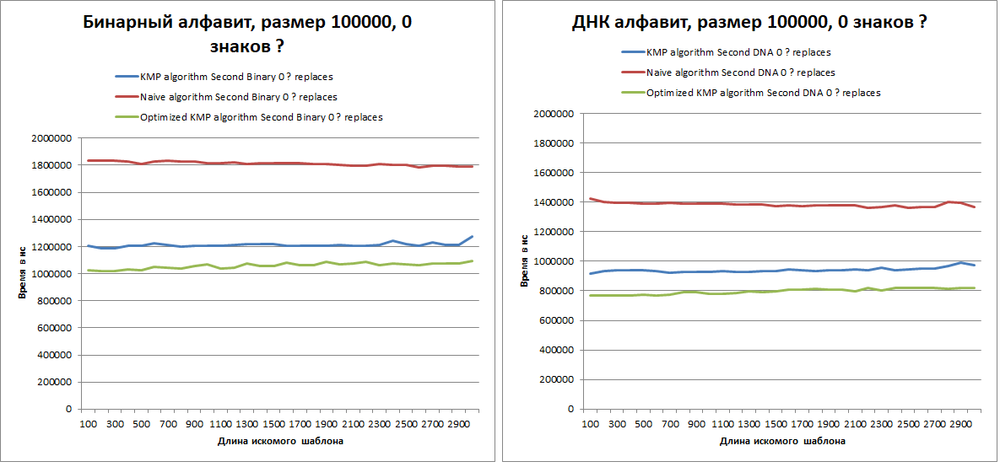

# StringAlgorithmsAnalysis
### Шиндяпкин Илья Дмитриевич
### БПИ-219
***
## Список реализованных алгоритмов поиска:
- [Naive algorithm](Algorithms/NaiveAlgorithm.cpp)
- [KMP algorithm](Algorithms/KMPAlgorithm.cpp)
- [KMP algorithm with refined borders](Algorithms/KMPOptimizedAlgorithm.cpp)
***

## Ввод данных
После запуска программы на выбор предоставляется выбор алгоритма поиска шаблона
в строке. Есть возможность выбрать конкретный или запустить выполнение всех 3
реализованных алгоритмов. Производится проверка на корректность выбранной опции.
Во время выполнения алгоритма в консоле будут выводиться результаты замеров и проверок.
Для временных замеров производится 50 повторений, после чего результат усредняется.
```
1. Naive algorithm
2. KMP algorithm
3. Optimized KMP algorithm
4. Perform all algorithms.
Input number of template finding algorithm: <input>
```

После окончания выполнения алгоритма есть возможность выбрать другой алгоритм,
поскольку работа программы зациклена. Для продолжения нужно ввести один символ 'y'.
Для завершения работы программы необходимо ввести символ 'n'.
Производится проверка на корректность введенной строки.
```
Continue? (y/n): <input>
```
***
## Сохранение данных
Данные сохраняются в файл csv: RawData.csv.
Этот файл сохраняется в папку проекта *cmake-build-debug*. Для git версии вынесен в общую директорию. 
***
## Подготовка полученных данных
Подробный анализ замеров представлены в файле Analytics.xlsx, находящийся в основной директории.
В файле созданы листы, которые разделяют данные по типам сгенерированных строк:
- Строка и шаблон, сгенерированные из символов бинарного алфавита, размера 10000.
- Строка и шаблон, сгенерированные из символов бинарного алфавита, размера 100000.
- Строка и шаблон, сгенерированные из символов ДНК-алфавита(4 символа), размера 10000.
- Строка и шаблон, сгенерированные из символов ДНК-алфавита(4 символа), размера 100000.

На основе этих данных были построены графики, которые расположены в этом же файле.
На каждом листе располагается 5 графиков для этого типа строки (каждый для определенного количества
добавленных символов подстановки "?" в диапазоне 0 - 4),
где ось Х - размер шаблона для поиска, ось Y - время выполнения алгоритма в наносекундах.
На этих графиках есть 3 линии, каждая из которых - результат указанного в легенде алгоритма поиска.

То есть итого в файле располагается 20 графиков.
***

## Обработка симоволов подстановки
- Для наивного алгоритма просто добавлено условие на знак подстановки при посимвольном сравнении,
поскольку "?" является любым символом из алфавита.
- Для обоих КМП алгоритмов был написан метод-обертка, благодаря которому появляется
возможность корректно обрабатывать шаблоны с символами подстановки.
При работе алгоритма шаблон
разбивается на части, используя "?" как разделитель. После этого с помощью КМП алгоритма для каждой
подпоследовательности ищутся вхождения в строке. Если найдено вхождение, то мы инкрементируем значение
в массиве счетчиков по индексу: {*найденная позиция*} - {*исходная позиция подпоследовательности в шаблоне*}.
Если какое-то значение в массиве счетчиков будет равняться количеству подпоследовательностей, то индекс этого
значения является одинм из ответов на задачу.

***
## Анализ полученных данных

### Влияние знаков подстановки
Для начала проанализируем, как знаки подстановки влияют на время работы алгоритмов:
На графиках бинарного алфавита малого размера мы можем наблюдать, что знаки подстановки
почти не влияют на время работы алгоритмов, поскольку КМП реализованы не перебором, а с подпоследовательностями:


При изменении алфавита или размера, так же не наблюдается большого влияния от добавления
символов подстановки:


В итоге можно сделать вывод, что добавление нескольких символов подстановки практически не 
влияется на время работы алгоритмов.

### Влияние размера алфавита

На графиках отчетливо видно, что увеличение размерности алфавита снижает время работы всех алгоритмов примерно на 27-33%.
И это верно, как для данных большого, так и маленького размера:


### Влияние размера строки
Смотря на график, можем заметить, что время исполнения алгоритмов растет пропорционально величине строки,
поскольку сложность наивного алгоритма O(m(n-m+1)), а для КМП O(n) в обоих случаях у нас изменяется только n,
поэтому видим такую картину на графике:


### Сравнение алгоритмов
Можем заметить, что на небольших объемах данных, наивный алгоритм показывается себя не сильно хуже,
а при максимальных размерах шаблона, даже лучше, чем КМП алгоритмы:


Но вот на больших данных, что явно видно, что КМП является более эффективным асимптотически,
его время работы здесь оказывается намного меньше, чем для наивного алгоритма:


## Вывод

В итоге можно сказать, что КМП является более эффективным для работы с данными почти любого размера, кроме очень маленьких,
а для таковых неплохо подойдет наивный алгоритм, поскольку не требует дополнительных предварительных вычислений.
Знаки подстановок практически не влияют на время выполнения алгоритма. Длина исходной строки пропорционально увеличивает
время выполнения алгоритмов, а размер алфавита наоборот уменьшает время работы.
